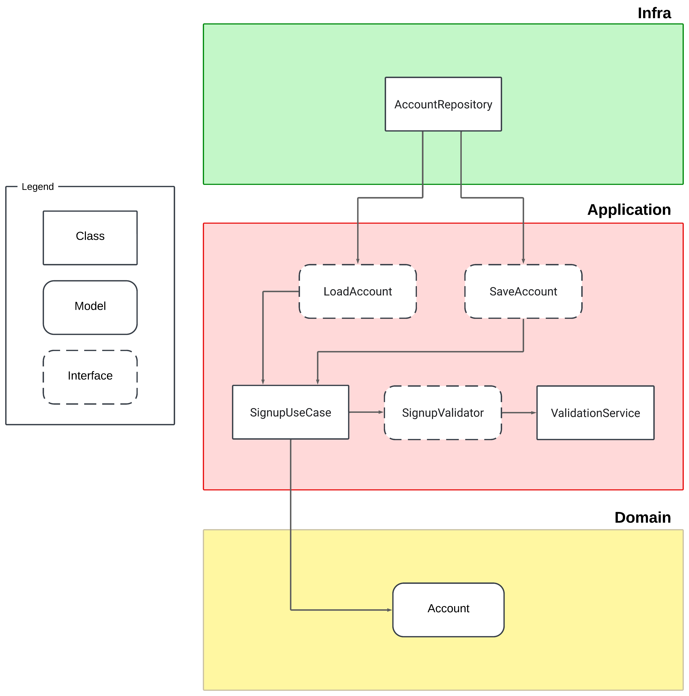

# Tópicos Especiais II

## Curso: Ciência da Computação  
**Universidade Estadual do Piauí (UESPI)**  

**Alunos:**  
- Francisco Mendes Magalhães Filho  
- Tiago da Silva Carvalho  

---

## Configurações do Projeto  

Para executar o projeto em sua máquina, siga os passos abaixo:  

1. **Clonar o Repositório:**  
   Clone o repositório utilizando o seguinte comando:  
   ```bash
   git clone https://github.com/FranciscoMends/tec2-aval
   ```

2. **Instalar Dependências:**  
   Acesse o diretório do projeto clonado e execute o comando:  
   ```bash
   yarn
   ```  

3. **Rodar os Testes:**  
   Para executar os testes, utilize um dos comandos abaixo:  

   - Rodar os testes uma única vez:  
     ```bash
     yarn test
     ```  

   - Rodar os testes em modo de observação (reexecuta os testes ao detectar alterações no código):  
     ```bash
     yarn test --watch
     ```  

---


## Caso de Uso Desenvolvido: **Signup (Criação de Conta)**  


---

## Diagrama de Dependência  

Abaixo, o diagrama de dependência do caso de uso **Signup**:  



---
